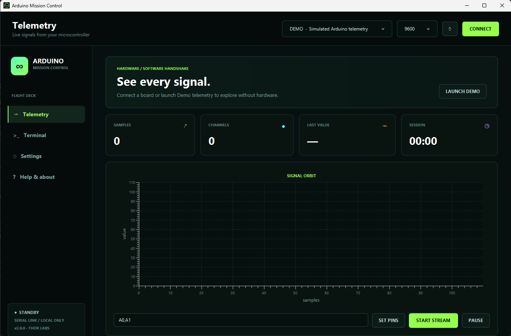

  
  <h1>Arduino Mission Control</h1>
  
<strong>See every signal. Command every orbit.</strong>

  
  
  

Arduino Mission Control is a private desktop station for serial diagnostics, live telemetry, and command control of Arduino-compatible boards. Version 2 replaces the original COM6 console prototype with a fluid interface that works on Windows, Linux, and macOS.

## Mission capabilities

- Discovers available serial ports automatically
- Supports 9600 through 115200 baud and configurable line endings
- Charts numeric channels from lines such as A0:512, TEMP=23.4, or RPM,1450
- Sends START, PAUSE, STOP, STATUS, PINS and custom commands
- Includes a raw bidirectional terminal
- Writes each telemetry session to a private CSV log
- Offers Demo telemetry when no board is connected
- Includes an Arduino demonstration sketch under arduino/mission_control_demo

No account, cloud service, analytics, or telemetry upload is used.

## Install

Download the package for your operating system from the [latest release](https://github.com/sofoste93/DiagnoseToolForArduino/releases/latest).

| Platform | Installer | Portable |
| --- | --- | --- |
| Windows x64 | EXE | ZIP |
| Linux x64 | DEB | TAR.GZ |
| macOS Apple Silicon | DMG | TAR.GZ |
| macOS Intel | DMG | TAR.GZ |

Every package contains a purpose-built Java 17 runtime. Java does not need to be installed separately.

Windows may show **Unknown publisher** until releases are signed with the project's Authenticode certificate. The build is already signing-ready; see [SIGNING.md](SIGNING.md).

## Connect a board

1. Open arduino/mission_control_demo/mission_control_demo.ino in Arduino IDE.
2. Upload it to an Arduino Uno or compatible board.
3. Start Mission Control, select the detected port and choose 9600 baud.
4. Press **Connect**, then **Start stream**.

On Linux, serial access usually requires membership in the dialout group:

    sudo usermod -aG dialout "$USER"

Log out and back in after changing group membership.

Session CSV files are stored in the operating system's standard application-data folder:

- Windows: %LOCALAPPDATA%/Arduino Mission Control/sessions
- Linux: $XDG_DATA_HOME/arduino-mission-control/sessions or ~/.local/share/arduino-mission-control/sessions
- macOS: ~/Library/Application Support/Arduino Mission Control/sessions

## Run from source

Requirements: JDK 17 and Maven 3.9 or newer.

    mvn clean javafx:run

Run tests:

    mvn clean verify

Create a local application with its embedded runtime:

    # Windows PowerShell
    ./scripts/package.ps1 -PackageType app-image

    # Linux or macOS
    ./scripts/package.sh app-image

## Deutsch

Arduino Mission Control erkennt serielle Schnittstellen automatisch, visualisiert Messwerte live, sendet Steuerbefehle und archiviert jede Sitzung lokal als CSV. Das mitgelieferte Demo-Programm kann direkt über die Arduino IDE auf ein kompatibles Board geladen werden. Für einen Test ohne Hardware steht **Demo telemetry** bereit.

## Credits

Original educational project by **Stephane Sob Fouodji** and **A. Franz**, rebuilt for a sustainable desktop release. Serial communication is powered by [jSerialComm](https://github.com/Fazecast/jSerialComm).

Released under the [MIT License](LICENSE).

**THOR // transmission complete beyond the serial frontier.**
